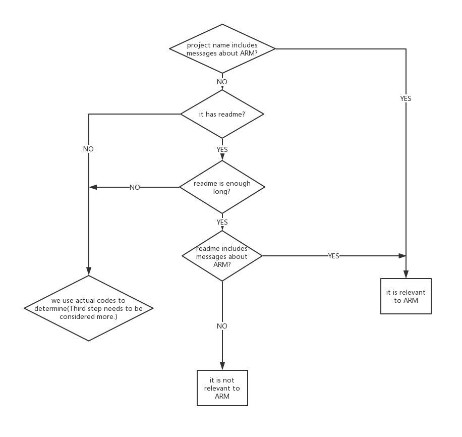

# Framework for locating projects (or contributions in projects) relevant to ARM

## Overview
      This framework aims to help us determine if one project that is relevant to ARM.   
    Through this framework, we could get all projects that are relevant to ARM in hundreds  
    of projects.  
      Given one project, determine if the project is relevant to ARM.  
## Process Flow
### First Step: project name      
      If project's name includes some messages about ARM, we identify the project is  
    relevant to ARM  
      Else, we goto Second Step.
### Second Step: Readme
      If the project doesn't have readme, we goto Third Step. 
      Else if readme is enough long(Exact length remains to be explored):
        If it includes some messages about ARM, we identify the project is relevant to ARM 
        Else,we identify the project isn't relevant to ARM  
      Else if readme is short:  
        If it includes some messages about ARM, we identify the project is relevant to ARM. 
        Else, we goto Third Step  
### Third step: actual source code
      I think we can firstly use suffix names to locate assembly files, and determine if  
    it is ARM assembly file.
      If we can't find ARM assembly file in the project,we need access to all code files  
    of the projects to determine if they have ARM assembly codes.
    
    
* Third step needs to be considered more.

## The figure depicting the process is below 

